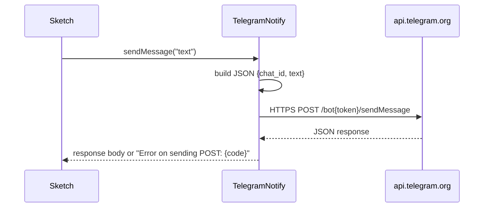

# TelegramNotify

TelegramNotify is a small Arduino library that sends text messages to a Telegram chat through the [Telegram Bot API](https://core.telegram.org/bots/api). You create the notifier with a bot token and a chat ID, then call one method to send a message. Use it for real-time alerts, sensor readings, or status updates from an ESP32 project, with minimal setup.

## Table of contents

- [Features](#features)
- [Supported hardware](#supported-hardware)
- [Requirements](#requirements)
- [Getting started](#getting-started)
- [Installation](#installation)
- [Quick start](#quick-start)
- [API reference](#api-reference)
- [How it works](#how-it-works)
- [Example walkthrough](#example-walkthrough)
- [Troubleshooting](#troubleshooting)
- [Security notes](#security-notes)
- [Contributing](#contributing)
- [License](#license)

## Features

- Send a plain-text message to any chat, group, or channel your bot can post to.
- One class, one method: `TelegramNotify(botToken, chatId)` and `sendMessage(text)`.
- The request body is built with ArduinoJson, so quotes, newlines, and other special characters in the message are escaped correctly.
- Returns the raw Telegram API response (or an error string), so you can log or inspect the result.
- The bot token and chat ID are copied when the object is created, so the strings you pass don't need to stay alive afterwards.

## Supported hardware

| Board family | Status |
|---|---|
| ESP32 (Arduino-ESP32 core) | Supported. The library includes `<HTTPClient.h>`, and the example uses `<WiFi.h>`, both from the ESP32 core. |
| ESP8266 | Not supported as-is. The ESP8266 core ships `ESP8266HTTPClient.h`, not `HTTPClient.h`. |
| AVR, SAMD, and other boards | Not supported. These cores don't provide the `HTTPClient.h` API this library uses. |

`library.properties` declares `architectures=*`, but the library is written for and only works on the ESP32 core.

## Requirements

- An ESP32 board with Wi-Fi access to the internet (`api.telegram.org` over HTTPS, port 443).
- Arduino IDE (or another Arduino toolchain) with the [Arduino-ESP32 core](https://github.com/espressif/arduino-esp32) installed.
- The [ArduinoJson](https://arduinojson.org/) library by Benoit Blanchon. Works with ArduinoJson 6 and 7. On ArduinoJson 7, `DynamicJsonDocument` is deprecated, so you'll see a compiler warning, but it builds and runs.
  `library.properties` has no `depends=` entry, so ArduinoJson is **not** installed automatically. Install it yourself from the Library Manager.
- A Telegram bot token and the ID of the chat that should receive the messages (see below).

## Getting started

### Create a Telegram bot

Before you can use this library, you need a Telegram bot:

1. Open [Telegram](https://web.telegram.org/) and sign in to your account, or create a new one.

2. Search for **@BotFather** and select it. Official Telegram bots have a blue checkmark next to their name.

    [](https://github.com/t0mer/voicy/blob/main/screenshots/scr1-min.png?raw=true "@BotFather")

3. Click **Start** to activate BotFather.

    [](https://github.com/t0mer/voicy/blob/main/screenshots/scr2-min.png?raw=true "Start")

4. BotFather replies with a list of commands for managing bots. Choose or type the `/newbot` command and send it.

    [](https://github.com/t0mer/voicy/blob/main/screenshots/scr3-min.png?raw=true "/newbot")

5. Choose a name for your bot. Your subscribers will see it in the conversation. Then choose a username. The bot can be found by its username in searches. The username must be unique and end with the word "bot".

    [](https://github.com/t0mer/voicy/blob/main/screenshots/scr4-min.png?raw=true "Username")

6. Once you choose a valid username, the bot is created. You receive a message with a link to your bot (`t.me/<bot_username>`), your bot's **token**, recommendations for setting a profile picture and description, and a list of commands for managing the bot.

    [](https://github.com/t0mer/voicy/blob/main/screenshots/scr5-min.png?raw=true "Bot created")

### Find your chat ID

The bot can only message a chat that has talked to it first (or a group/channel it has been added to).

1. Open a chat with your new bot and send it any message.
2. Open `https://api.telegram.org/bot<YOUR_BOT_TOKEN>/getUpdates` in a browser.
3. Find `"chat":{"id": ... }` in the response. That number is your chat ID. Group IDs are negative numbers; for a public channel you can also use `@channelusername`.

The chat ID is passed to the library as a string, for example `"123456789"` or `"-1001234567890"`.

## Installation

TelegramNotify is **not** listed in the Arduino Library Manager index, so install it manually with one of the methods below.

**After any option**, install **ArduinoJson** from **Tools → Manage Libraries…**, because it is not installed automatically (see [Requirements](#requirements)).

### Option 1: Add .ZIP Library (Arduino IDE)

1. Download the source ZIP of the latest release from the [GitHub releases page](https://github.com/t0mer/TelegramNotify/releases).
2. In the Arduino IDE, choose **Sketch → Include Library → Add .ZIP Library…** and select the downloaded file.

### Option 2: Copy into the libraries folder

1. Download and extract the release ZIP.
2. The GitHub ZIP extracts to a folder named `TelegramNotify-1.0.0`. Rename it to `TelegramNotify`.
3. Move the renamed folder into the `libraries` directory of your Arduino sketchbook (for example `~/Arduino/libraries/TelegramNotify`).
4. Restart the Arduino IDE.

### Option 3: git clone

```bash
cd ~/Arduino/libraries
git clone https://github.com/t0mer/TelegramNotify.git
```

## Quick start

```cpp
#include <WiFi.h>
#include <TelegramNotify.h>

const char* ssid = "YOUR_SSID";
const char* password = "YOUR_PASSWORD";

const char* botToken = "YOUR_BOT_TOKEN";
const char* chatId = "YOUR_CHAT_ID";

TelegramNotify telegramNotify(botToken, chatId);

void setup() {
  Serial.begin(115200);
  WiFi.begin(ssid, password);
  while (WiFi.status() != WL_CONNECTED) {
    delay(1000);
    Serial.println("Connecting to WiFi...");
  }
  Serial.println("Connected to WiFi");

  String response = telegramNotify.sendMessage("Hello from ESP32!");
  Serial.println(response);
}

void loop() {
  // Nothing here
}
```

Replace `YOUR_SSID`, `YOUR_PASSWORD`, `YOUR_BOT_TOKEN`, and `YOUR_CHAT_ID` with your own values.

## API reference

The library exposes a single class, `TelegramNotify`, declared in `src/TelegramNotify.h`.

### `TelegramNotify(const char* botToken, const char* chatId)`

Creates a notifier for one bot and one chat.

| Parameter | Type | Description |
|---|---|---|
| `botToken` | `const char*` | Bot token from @BotFather, for example `123456:ABC-DEF...`. |
| `chatId` | `const char*` | Target chat ID as a string (numeric ID or `@channelusername`). |

Both values are copied into internal `String` members. The constructor does no network I/O, so it is safe to create the object globally before Wi-Fi is connected.

### `String sendMessage(const char* message)`

Sends `message` to the configured chat with the Bot API `sendMessage` method. The call is blocking: it returns once the HTTP request has finished or failed.

| Parameter | Type | Description |
|---|---|---|
| `message` | `const char*` | The message text, sent as plain text. |

**Returns** a `String`:

- If the server answered (any HTTP status, including 4xx/5xx), the raw JSON response body from Telegram. A successful send looks like `{"ok":true,"result":{...}}`; a failure looks like `{"ok":false,"error_code":400,"description":"..."}`.
- If the request could not be sent at all (no connection, TLS failure, timeout), the text `Error on sending POST: <code>`, where `<code>` is a negative `HTTPClient` error code (for example `-1` for "connection refused").

To check for success, look for `"ok":true` in the returned string. The method does not parse the response for you.

### Message formatting

- The request is a `POST` to `https://api.telegram.org/bot<token>/sendMessage` with `Content-Type: application/json` and the body `{"chat_id": "...", "text": "..."}`.
- No `parse_mode` is sent, so Markdown and HTML are **not** rendered; the text appears exactly as written.
- Because the body is JSON built with ArduinoJson, no URL encoding is needed. Quotes, backslashes and newlines are escaped automatically; UTF-8 text (including emoji) is sent as-is and displays correctly.

## How it works



Each call creates a new `HTTPClient`, sends one request, reads the response, and closes the connection. The library doesn't change the timeout, so `HTTPClient`'s default of 5000 ms applies.

## Example walkthrough

The library ships one example, **File → Examples → TelegramNotify → SendTelegramMessage** (`examples/SendTelegramMessage/SendTelegramMessage.ino`). It is the same sketch as the [Quick start](#quick-start):

1. Creates a global `TelegramNotify` object from the bot token and chat ID.
2. In `setup()`, starts the serial port at 115200 baud and connects to Wi-Fi, printing `Connecting to WiFi...` every second until connected.
3. Sends the message `Hello from ESP32!` once and prints the Telegram response to the Serial Monitor.
4. `loop()` is empty, so the message is sent only once per boot.

Open the Serial Monitor at **115200 baud** to see the result.

## Troubleshooting

| Symptom | Likely cause |
|---|---|
| `fatal error: HTTPClient.h: No such file or directory` | You are not compiling for an ESP32 board. Select an ESP32 board and install the ESP32 core. |
| `fatal error: ArduinoJson.h: No such file or directory` | ArduinoJson is not installed. Install it from the Library Manager. |
| Response `Error on sending POST: -1` (or another negative number) | The request never reached Telegram: no Wi-Fi, DNS failure, no internet access, or a TLS handshake failure. Check that `WiFi.status()` is `WL_CONNECTED` before calling `sendMessage()`. |
| `{"ok":false,"error_code":401,"description":"Unauthorized"}` or `{"ok":false,"error_code":404,"description":"Not Found"}` | The bot token is wrong or malformed. |
| `{"ok":false,"error_code":400,"description":"Bad Request: chat not found"}` | Wrong chat ID, or the chat has never messaged the bot (or the bot isn't a member of the group/channel). |
| `{"ok":false,"error_code":400,"description":"Bad Request: message text is empty"}` | The message was empty or too long. With ArduinoJson 6, the message can be at most about 990 bytes minus the chat ID length (about 980 bytes of UTF-8 for a 10-digit ID); longer text is sent as null. With ArduinoJson 7, there is no library-side limit, and Telegram's own 4096-character limit applies (`Bad Request: message is too long`). |
| `{"ok":false,"error_code":403,"description":"Forbidden: bot was blocked by the user"}` or `...bot can't initiate conversation with a user` | The user blocked the bot, or never started it. Send `/start` to the bot first (and unblock it if needed). |
| `{"ok":false,"error_code":429,...}` | Telegram rate limit. Send fewer messages. |

## Security notes

- **Server certificate validation.** The library calls `HTTPClient::begin()` with an HTTPS URL but without a CA certificate or fingerprint. On the ESP32 core, this makes the connection encrypted but does **not** verify that the server really is `api.telegram.org`. An attacker who can intercept your network traffic could read your bot token and messages. Use trusted networks for anything sensitive. This applies to Arduino-ESP32 1.x, 2.x and 3.x: without a CA certificate, `HTTPClient` calls `WiFiClientSecure::setInsecure()`.
- **The bot token is a password.** Anyone with it can control your bot. Never commit a real token, chat ID, or Wi-Fi password to a public repository; keep them in a git-ignored header (for example `secrets.h`). If a token leaks, revoke it with `/revoke` in @BotFather.
- The token is part of the request URL, so avoid printing the URL or the token to logs. If you set **Tools → Core Debug Level** to **Verbose**, `HTTPClient` logs the request URL, bot token included, to the serial port.

## Contributing

Issues and pull requests are welcome at [github.com/t0mer/TelegramNotify](https://github.com/t0mer/TelegramNotify). Please test changes on real hardware and keep the example sketch compiling.

## License

TelegramNotify is licensed under the [Apache License 2.0](LICENSE).
